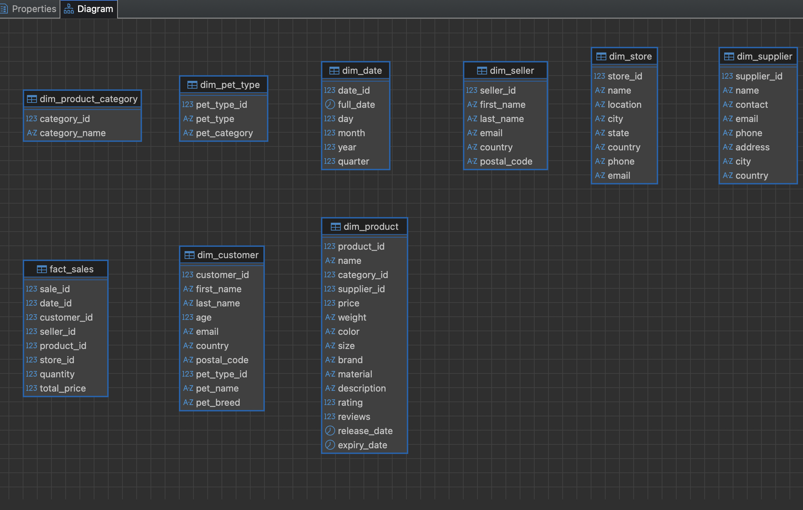

# BigDataSpark
Анализ больших данных - лабораторная работа №2 - ETL реализованный с помощью Spark

Одним из самых популярных фреймворков для работы с Big Data является Apache Spark. Apache Spark - мощный фреймворк, который предлагает широкий набор функциональности для простого написания ETL-пайплайнов.

Что необходимо сделать? 

Необходимо реализовать ETL-пайплайн с помощью Spark, который трансформирует данные из источника (файлы mock_data.csv с номерами) в модель данных звезда в PostgreSQL, а затем на основе модели данных звезда создать ряд отчетов по данным в одной из NoSQL базах данных обязательно и в нескольких других опционально (будет бонусом). Каждый отчет представляет собой отдельную таблицу в NoSQL БД.

Какие отчеты надо создать?
1. Витрина продаж по продуктам
Цель: Анализ выручки, количества продаж и популярности продуктов.
 - Топ-10 самых продаваемых продуктов.
 - Общая выручка по категориям продуктов.
 - Средний рейтинг и количество отзывов для каждого продукта.
2. Витрина продаж по клиентам
Цель: Анализ покупательского поведения и сегментация клиентов.
 - Топ-10 клиентов с наибольшей общей суммой покупок.
 - Распределение клиентов по странам.
 - Средний чек для каждого клиента.
3. Витрина продаж по времени
Цель: Анализ сезонности и трендов продаж.
 - Месячные и годовые тренды продаж.
 - Сравнение выручки за разные периоды.
 - Средний размер заказа по месяцам.
4. Витрина продаж по магазинам
Цель: Анализ эффективности магазинов.
 - Топ-5 магазинов с наибольшей выручкой.
 - Распределение продаж по городам и странам.
 - Средний чек для каждого магазина.
5. Витрина продаж по поставщикам
Цель: Анализ эффективности поставщиков.
 - Топ-5 поставщиков с наибольшей выручкой.
 - Средняя цена товаров от каждого поставщика.
 - Распределение продаж по странам поставщиков.
6. Витрина качества продукции
Цель: Анализ отзывов и рейтингов товаров.
 - Продукты с наивысшим и наименьшим рейтингом.
 - Корреляция между рейтингом и объемом продаж.
 - Продукты с наибольшим количеством отзывов.

В каких NoSQL БД должны быть эти отчеты:
1. **Clickhouse** **(обязательно)**
2. Cassandra (опционально, если будет реализация, то это бонус)
3. Neo4J (опционально, если будет реализация, то это бонус)
4. MongoDB (опционально, если будет реализация, то это бонус)
5. Valkey (опционально, если будет реализация, то это бонус)


Алгоритм:
1. Клонируете к себе этот репозиторий.
2. Устанавливаете себе инструмент для работы с запросами SQL (рекомендую DBeaver).
3. Устанавливаете базу данных PostgreSQL (рекомендую установку через docker).
4. Устанавливаете Apache Spark (рекомендую установку через Docker. Для удобства написания кода на Python можно запустить вместе со JupyterNotebook. Для Java - подключить volume и собрать образ Docker, который будет запускать команду spark-submit с java jar-файлом при старте контейнера, сам jar файл собирается отдельно и кладется в подключенный volume)
5. Скачиваете файлы с исходными данными mock_data( * ).csv, где ( * ) номера файлов. Всего 10 файлов, каждый по 1000 строк.
6. Импортируете данные в БД PostgreSQL (например, через механизм импорта csv в DBeaver). Всего в таблице mock_data должно находиться 10000 строк из 10 файлов.
7. Анализируете исходные данные с помощью запросов.
8. Выявляете сущности фактов и измерений.
9. Реализуете приложение на Spark, которое по аналогии с первой лабораторной работой перекладывает исходные данные из PostgreSQL в модель снежинку/звезда в PostgreSQL. (Убедитесь в коннективности Spark и PostgreSQL, настройте сеть между Spark и PostgreSQL, если используете Docker).
10. Устанавливаете ClickHouse (рекомендую установку через Docker. Убедитесь в коннективности Spark и Clickhouse, настройте сеть между Spark и ClickHouse). **(обязательно)**
11. Реализуете приложение на Spark, которое создаёт все 6 перечисленных выше отчетов в виде 6 отдельных таблиц в ClickHouse. **(обязательно)**
12. Устанавливаете Cassandra (рекомендую установку через Docker. Убедитесь в коннективности Spark и Cassandra, настройте сеть между Spark и Cassandra). (опционально)
13. Реализуете приложение на Spark, которое создаёт все 6 перечисленных выше отчетов в виде 6 отдельных таблиц в Cassandra. (опционально)
14. Устанавливаете Neo4j (рекомендую установку через Docker. Убедитесь в коннективности Spark и Neo4j, настройте сеть между Spark и Neo4j). (опционально)
15. Реализуете приложение на Spark, которое создаёт все 6 перечисленных выше отчетов в виде отдельных сущностей в Neo4j. (опционально)
16. Устанавливаете MongoDB (рекомендую установку через Docker. Убедитесь в коннективности Spark и MongoDB, настройте сеть между Spark и MongoDB). (опционально)
17. Реализуете приложение на Spark, которое создаёт все 6 перечисленных выше отчетов в виде 6 отдельных коллекций в MongoDB. (опционально)
18. Устанавливаете Valkey (рекомендую установку через Docker. Убедитесь в коннективности Spark и Valkey, настройте сеть между Spark и Valkey). (опционально)
19. Реализуете приложение на Spark, которое создаёт все 6 перечисленных выше отчетов в виде отдельных записей в Valkey. (опционально)
20. Проверяете отчеты в каждой базе данных средствами языка самой БД (ClickHouse - SQL (DBeaver), Cassandra - CQL (DBeaver), Neo4J - Cipher (DBeaver), MongoDB - MQL (Compass), Valkey - redis-cli).
21. Отправляете работу на проверку лаборантам.

Что должно быть результатом работы?
1. Репозиторий, в котором есть исходные данные mock_data().csv, где () номера файлов. Всего 10 файлов, каждый по 1000 строк.
2. Файл docker-compose.yml с установкой PostgreSQL, Spark, ClickHouse **(обязательно)**, Cassandra (опционально), Neo4j (опционально), MongoDB (опционально), Valkey (опционально) и заполненными данными в PostgreSQL из файлов mock_data(*).csv.
3. Инструкция, как запускать Spark-джобы для проверки лабораторной работы.
4. Код Apache Spark трансформации данных из исходной модели в снежинку/звезду в PostgreSQL.
5. Код Apache Spark трансформации данных из снежинки/звезды в отчеты в ClickHouse.
6. Код Apache Spark трансформации данных из снежинки/звезды в отчеты в Cassandra.
7. Код Apache Spark трансформации данных из снежинки/звезды в отчеты в Neo4j.
8. Код Apache Spark трансформации данных из снежинки/звезды в отчеты в MongoDB.
9. Код Apache Spark трансформации данных из снежинки/звезды в отчеты в Valkey.

---

## Комментарии (что я сделал)

Построил полный ETL-пайплайн на PySpark поверх Jupyter Lab — это удобнее, чем `spark-submit` «вслепую»: код можно итерировать прямо в ноутбуке, а потом оформить в `.py` для автоматического прогона. Все четыре сервиса (PostgreSQL, ClickHouse, Cassandra, Spark) подняты через `docker-compose` в одной сети `bigdata`, так что Spark видит их по именам хостов без лишней настройки.

В `01_etl_to_star.py` суррогатные ключи для справочников (`dim_pet_type`, `dim_product_category`, `dim_supplier`, `dim_store`, `dim_date`) сгенерированы через `row_number().over(Window.orderBy(...))` — это детерминировано при одинаковых данных. Для `fact_sales` использовал `monotonically_increasing_id()`, потому что `id` в CSV повторяется 1–1000 в каждом из десяти файлов, то есть натурального уникального ключа нет.

Во всех трёх джобах применён паттерн `df.cache()` -> `count()` -> `write()` -> `unpersist()`: DataFrame материализуется один раз, лишний пересчёт исключён. Витрина по времени содержит как помесячные строки, так и годовые итоги (`month = 0, period_type = 'yearly'`), чтобы закрыть требование об анализе трендов по обоим периодам сразу.

Для бонусной NoSQL выбрал Cassandra — DBeaver поддерживает CQL нативно без дополнительных плагинов (MongoDB требует Compass, Valkey работает только через redis-cli). Коннективность Spark - Cassandra реализована через `spark-cassandra-connector-assembly`; keyspace и таблицы создаются через `cassandra-driver` Python перед первой записью, чтобы явно задать PRIMARY KEY под каждую витрину. Пакет устанавливается один раз — при повторных запусках проверяется его наличие и пропускается.

---

## Как запустить

### 0. Запустить всё одной командой (рекомендуется)

```bash
bash run.sh
```

Скрипт автоматически: скачает JDBC-драйверы, поднимет все контейнеры, дождётся их готовности и последовательно прогонит все три ETL-джобы. В конце выведет сводку по таблицам в ClickHouse и Cassandra.

### 1. Поднять стек вручную

```bash
docker compose up -d
docker compose logs -f postgres   # ждём "ready to accept connections"
```

PostgreSQL загрузит все 10 CSV и создаст схему `star` (через `postgres/init/`).

Проверка staging:
```bash
docker compose exec postgres psql -U postgres -d mydatabase \
  -c "SELECT count(*) FROM mock_data;"
# ожидается 10000
```

### 2. Запустить ETL: mock_data → star schema (PostgreSQL)

Открыть Jupyter Lab: http://localhost:8888 (токен: `spark`)

В терминале Jupyter:
```bash
spark-submit --jars /opt/spark-jars/postgresql-42.7.4.jar \
  jobs/01_etl_to_star.py
```

Проверка:
```bash
docker compose exec postgres psql -U postgres -d mydatabase \
  -c "SELECT count(*) FROM star.fact_sales;"
# ожидается 10000
```

### 3. Запустить ETL: star schema → витрины в ClickHouse

```bash
spark-submit \
  --jars /opt/spark-jars/postgresql-42.7.4.jar,/opt/spark-jars/clickhouse-jdbc-0.6.5-shaded.jar \
  jobs/02_etl_to_clickhouse.py
```

Проверка в ClickHouse (DBeaver → ClickHouse, host `localhost:8123`, user `clickhouse`, password `password`, database `reports`):
```sql
SELECT * FROM reports.mart_sales_by_product     ORDER BY revenue_rank LIMIT 10;
SELECT * FROM reports.mart_sales_by_customer    ORDER BY revenue_rank LIMIT 10;
SELECT * FROM reports.mart_customers_by_country ORDER BY country_rank;
SELECT * FROM reports.mart_sales_by_time        ORDER BY year, month;
SELECT * FROM reports.mart_sales_by_store       ORDER BY revenue_rank LIMIT 5;
SELECT * FROM reports.mart_sales_by_supplier    ORDER BY revenue_rank LIMIT 5;
SELECT * FROM reports.mart_suppliers_by_country ORDER BY country_rank;
SELECT * FROM reports.mart_product_quality      ORDER BY rating_rank  LIMIT 10;
```

### 4. Запустить ETL: star schema → витрины в Cassandra (бонус)

```bash
spark-submit \
  --jars /opt/spark-jars/postgresql-42.7.4.jar,/opt/spark-jars/spark-cassandra-connector-assembly_2.12-3.5.0.jar \
  jobs/03_etl_to_cassandra.py
```

Проверка в DBeaver: **New Connection → Apache Cassandra**
- Host: `localhost`, Port: `9042` (без логина и пароля)
- Database / Keyspace: `reports`

```sql
SELECT * FROM mart_sales_by_product     LIMIT 10;
SELECT * FROM mart_customers_by_country;
SELECT * FROM mart_sales_by_time        WHERE year = 2021;
```

### Состав витрин

| Таблица | Содержание |
|---|---|
| `mart_sales_by_product` |  Выручка по товарам, топ-10, средний рейтинг |
| `mart_sales_by_customer` |  Топ клиентов, средний чек |
| `mart_customers_by_country` |  Распределение клиентов по странам |
| `mart_sales_by_time` |  Месячные и годовые тренды (`month=0` — год целиком) |
| `mart_sales_by_store` |  Топ-5 магазинов, города, страны |
| `mart_sales_by_supplier` |  Топ-5 поставщиков, средняя цена |
| `mart_suppliers_by_country` |  Распределение продаж по странам поставщиков |
| `mart_product_quality` |  Рейтинг и отзывы товаров |

### Структура схемы


